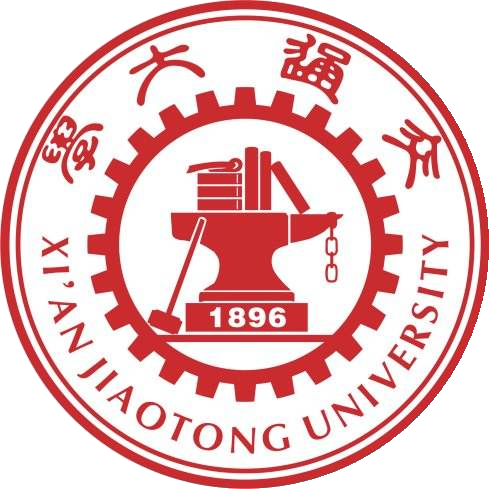

# 钱院学辅成立了！

## 前言
> 一日无书，百事荒芜。——陈寿

**钱院学辅**（Qian Yuan Xue Fu）是以学业辅导为主业，以钱学森书院为平台，
业务范围涵盖学业辅导、资料编写、学术交流活动等领域的大型学业辅导机构。学辅
自2019年成立以来，已经连续多年获得“*钱院十大社团*”和“*西安交大十佳学辅机构*”
称号，2019年辅导人数超过100人次，是西安交通大学学业辅导领域的龙头机构之一，
也是西安交大知名学习社团品牌之一[^1]。

[^1]: 以上描述修改自北京居然之家投资控股集团有限公司的“[企业介绍](http://www.juran.com.cn/node/111)”栏目。

## 代码展示
以下是一段未知的代码：

    begin
    if 0=0 then begin
        writeln('钱院学辅最厉害！')
    begin;
    begin.

它究竟是什么语言呢？原来是`Pascal`语言：

```pascal
begin
if 0=0 then begin
    writeln('钱院学辅最厉害！')
begin;
begin.
```

## 图表展示
让我们来看一看我们的校徽：



这个校徽的信息如下：

属性|值|备注
:--|:-:|--:
名称|'校徽'|西安交大校徽
文件名|'logo.png'|与本文件同目录
大小|347KB|$347 = 3\times10^2 + 4\times10 + 7$
没了|*真的没了*|**没骗你，真的没了**